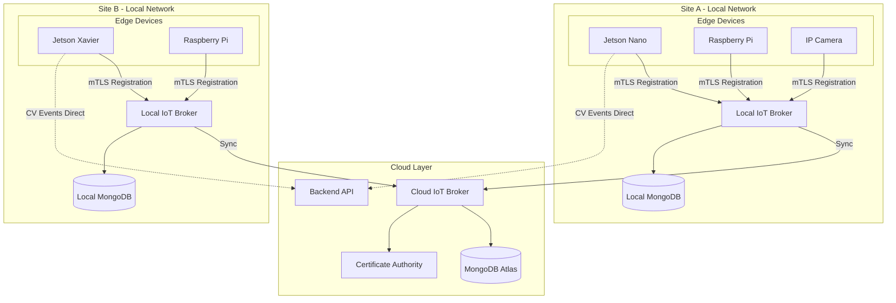
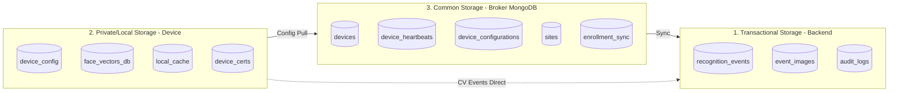
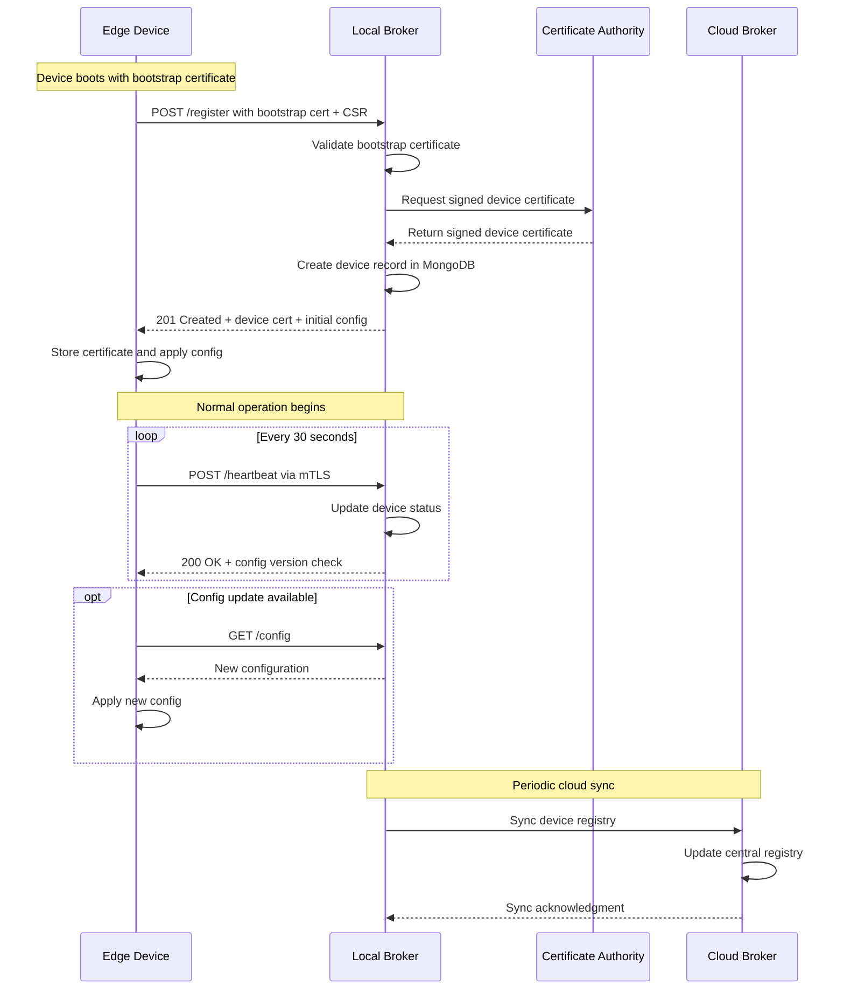

# IoT Device Broker Framework for Facial Recognition System

## Overview

This document outlines a hybrid IoT broker system for facial recognition edge devices that handles device registration, configuration management, and status tracking across local and cloud deployments, using mTLS for authentication and MongoDB for persistence.

The broker acts as a **device registry and configuration manager**, NOT a message broker for live events. Edge devices send CV outputs (recognition events, images) directly to the backend API, while the broker handles:

- Device provisioning and registration
- Certificate management and authentication
- Configuration distribution
- Health monitoring and status tracking
- Local-to-cloud synchronization

---

## Architecture Overview



---

## Communication Protocols

### 1. Device Registration (Webhook-based)

Devices register via HTTPS POST with their bootstrap certificate:

```http
POST /api/v1/devices/register
Content-Type: application/json
X-Device-Cert: <base64-encoded-client-cert>

{
    "device_id": "edge-jetson-001",
    "device_type": "jetson_nano",
    "capabilities": ["face_detection", "face_recognition", "liveness"],
    "firmware_version": "2.1.0",
    "cv_model_versions": {
        "detector": "retinaface_v1.2",
        "embedder": "facenet512_v1.0"
    },
    "network": {
        "mac_address": "AA:BB:CC:DD:EE:FF",
        "local_ip": "192.168.1.100"
    },
    "location": {
        "site_id": "site-hq-001",
        "zone": "entrance_main",
        "gps": {"lat": 37.7749, "lng": -122.4194}
    }
}
```

**Response (201 Created):**

```json
{
    "device_id": "edge-jetson-001",
    "status": "provisioned",
    "certificate": {
        "device_cert": "<base64-pem>",
        "ca_chain": "<base64-pem>",
        "expires_at": "2026-12-24T00:00:00Z"
    },
    "config": { ... },
    "broker_endpoints": {
        "heartbeat": "https://broker.site-hq.local/api/v1/devices/edge-jetson-001/heartbeat",
        "config": "https://broker.site-hq.local/api/v1/devices/edge-jetson-001/config"
    }
}
```

### 2. Heartbeat Protocol

Devices send periodic heartbeats (every 30 seconds) to maintain status:

```http
POST /api/v1/devices/{device_id}/heartbeat
Content-Type: application/json

{
    "timestamp": "2025-12-24T10:30:00Z",
    "status": "operational",
    "metrics": {
        "cpu_percent": 45.2,
        "memory_percent": 62.1,
        "gpu_memory_mb": 1024,
        "temperature_c": 52.0,
        "uptime_seconds": 86400
    },
    "cv_stats": {
        "frames_processed": 1847,
        "detections_count": 234,
        "recognitions_count": 189,
        "avg_inference_ms": 45.2
    },
    "queue_depth": 0,
    "last_event_ts": "2025-12-24T10:29:55Z"
}
```

**Response:**

```json
{
    "ack": true,
    "server_time": "2025-12-24T10:30:01Z",
    "config_version": "v2.3",
    "config_update_available": false
}
```

### 3. Configuration Pull

Devices poll for configuration updates (or receive push via WebSocket):

```http
GET /api/v1/devices/{device_id}/config?version={current_version}
```

**Response (if updated):**

```json
{
    "config_version": "v2.3",
    "updated_at": "2025-12-24T08:00:00Z",
    "recognition": {
        "confidence_threshold": 0.85,
        "liveness_enabled": true,
        "liveness_threshold": 0.7,
        "max_faces_per_frame": 5,
        "min_face_size_px": 80,
        "detection_interval_ms": 100
    },
    "enrollment_db": {
        "sync_url": "https://broker.local/api/v1/enrollments/sync",
        "last_sync": "2025-12-24T00:00:00Z"
    },
    "backend_endpoints": {
        "event_submit": "https://api.backend.com/v1/events",
        "image_upload": "https://api.backend.com/v1/images"
    },
    "reporting": {
        "heartbeat_interval_seconds": 30,
        "event_batch_size": 10,
        "event_batch_timeout_ms": 5000
    }
}
```

---

## Storage Architecture

The system uses three distinct storage layers with clear separation of concerns:



### Storage Layer Descriptions

| Layer | Location | Purpose | Data Types |
|-------|----------|---------|------------|
| **Transactional** | Backend cloud | Recognition events, audit trails | Events, images, logs |
| **Private/Local** | Edge device | Device identity, local cache | Configs, certs, face vectors |
| **Common** | Broker (local + cloud) | Device registry, coordination | Devices, heartbeats, configs |

---

## MongoDB Collections Schema

### Common Storage (Broker Database)

#### Collection: `devices`

Primary device registry - the core of the broker.

```javascript
{
    "_id": ObjectId,
    "device_id": "edge-jetson-001",          // Unique identifier
    "device_type": "jetson_nano",            // jetson_nano, jetson_xavier, rpi4, ip_camera
    "status": "online",                       // online, offline, maintenance, provisioning
    
    // Certificate Identity
    "certificate": {
        "fingerprint": "SHA256:abc123...",
        "issued_at": ISODate("2025-12-24T00:00:00Z"),
        "expires_at": ISODate("2026-12-24T00:00:00Z"),
        "issuer": "site-ca-001",
        "serial_number": "1234567890"
    },
    
    // Capabilities and Versions
    "capabilities": ["face_detection", "face_recognition", "liveness"],
    "firmware_version": "2.1.0",
    "cv_models": {
        "detector": {"name": "retinaface", "version": "1.2"},
        "embedder": {"name": "facenet512", "version": "1.0"}
    },
    
    // Location Hierarchy
    "location": {
        "site_id": "site-hq-001",
        "zone_id": "zone-entrance-main",
        "zone_name": "Main Entrance",
        "gps": {"type": "Point", "coordinates": [-122.4194, 37.7749]},
        "floor": 1,
        "description": "Front door camera"
    },
    
    // Network Configuration
    "network": {
        "mac_address": "AA:BB:CC:DD:EE:FF",
        "local_ip": "192.168.1.100",
        "broker_url": "https://broker.site-hq.local",
        "backend_urls": {
            "events": "https://api.backend.com/v1/events",
            "images": "https://api.backend.com/v1/images"
        }
    },
    
    // Configuration Reference
    "config_version": "v2.3",
    "config_applied_at": ISODate("2025-12-24T08:00:00Z"),
    
    // Timestamps
    "registered_at": ISODate("2025-01-01T00:00:00Z"),
    "last_seen": ISODate("2025-12-24T10:30:00Z"),
    "updated_at": ISODate("2025-12-24T08:00:00Z"),
    
    // Sync metadata (for hybrid topology)
    "sync": {
        "cloud_synced": true,
        "cloud_sync_at": ISODate("2025-12-24T10:00:00Z"),
        "local_broker_id": "broker-site-hq-001"
    }
}
```

**Indexes:**

```javascript
db.devices.createIndex({ "device_id": 1 }, { unique: true })
db.devices.createIndex({ "status": 1 })
db.devices.createIndex({ "location.site_id": 1 })
db.devices.createIndex({ "certificate.fingerprint": 1 })
db.devices.createIndex({ "last_seen": 1 })
db.devices.createIndex({ "location.gps": "2dsphere" })
```

#### Collection: `device_heartbeats`

Time-series collection for device health (TTL indexed for automatic cleanup).

```javascript
{
    "_id": ObjectId,
    "device_id": "edge-jetson-001",
    "timestamp": ISODate("2025-12-24T10:30:00Z"),
    "status": "operational",               // operational, degraded, error
    
    "metrics": {
        "cpu_percent": 45.2,
        "memory_percent": 62.1,
        "gpu_memory_mb": 1024,
        "disk_percent": 30.5,
        "temperature_c": 52.0,
        "uptime_seconds": 86400
    },
    
    "cv_stats": {
        "frames_processed": 1847,
        "detections_count": 234,
        "recognitions_count": 189,
        "avg_inference_ms": 45.2
    },
    
    "queue_depth": 0,
    "errors": []
}
```

**Indexes:**

```javascript
// TTL Index - auto-delete after 7 days
db.device_heartbeats.createIndex(
    { "timestamp": 1 }, 
    { expireAfterSeconds: 604800 }
)
db.device_heartbeats.createIndex({ "device_id": 1, "timestamp": -1 })
```

#### Collection: `device_configurations`

Versioned configuration templates.

```javascript
{
    "_id": ObjectId,
    "config_id": "config-recognition-v2.3",
    "version": "v2.3",
    "device_type": "jetson_nano",          // or "*" for all device types
    "site_id": "site-hq-001",              // or "*" for all sites
    
    "recognition": {
        "confidence_threshold": 0.85,
        "liveness_enabled": true,
        "liveness_threshold": 0.7,
        "max_faces_per_frame": 5,
        "min_face_size_px": 80,
        "detection_interval_ms": 100
    },
    
    "enrollment": {
        "sync_enabled": true,
        "sync_interval_minutes": 15,
        "local_cache_max_entries": 10000
    },
    
    "reporting": {
        "heartbeat_interval_seconds": 30,
        "event_batch_size": 10,
        "event_batch_timeout_ms": 5000
    },
    
    "created_at": ISODate("2025-12-24T00:00:00Z"),
    "created_by": "admin@company.com",
    "active": true
}
```

**Indexes:**

```javascript
db.device_configurations.createIndex({ "config_id": 1 }, { unique: true })
db.device_configurations.createIndex({ "device_type": 1, "site_id": 1, "active": 1 })
db.device_configurations.createIndex({ "version": 1 })
```

#### Collection: `sites`

Location hierarchy and site metadata.

```javascript
{
    "_id": ObjectId,
    "site_id": "site-hq-001",
    "name": "Headquarters",
    "address": {
        "street": "123 Main St",
        "city": "San Francisco",
        "state": "CA",
        "postal_code": "94102",
        "country": "US"
    },
    "timezone": "America/Los_Angeles",
    
    "local_broker": {
        "broker_id": "broker-site-hq-001",
        "url": "https://broker.site-hq.local:8443",
        "status": "online",
        "last_sync": ISODate("2025-12-24T10:00:00Z")
    },
    
    "zones": [
        {
            "zone_id": "zone-entrance-main",
            "name": "Main Entrance",
            "floor": 1,
            "device_count": 2
        },
        {
            "zone_id": "zone-lobby",
            "name": "Lobby",
            "floor": 1,
            "device_count": 3
        },
        {
            "zone_id": "zone-parking-a",
            "name": "Parking A",
            "floor": -1,
            "device_count": 4
        }
    ],
    
    "device_count": 12,
    "created_at": ISODate("2025-01-01T00:00:00Z"),
    "updated_at": ISODate("2025-12-24T00:00:00Z")
}
```

**Indexes:**

```javascript
db.sites.createIndex({ "site_id": 1 }, { unique: true })
db.sites.createIndex({ "local_broker.broker_id": 1 })
```

#### Collection: `enrollment_sync`

Tracks face enrollment database synchronization to devices.

```javascript
{
    "_id": ObjectId,
    "device_id": "edge-jetson-001",
    "sync_version": 1547,
    "last_sync_at": ISODate("2025-12-24T00:00:00Z"),
    "enrolled_count": 2341,
    "checksum": "sha256:abc123def456...",
    "status": "synced",                    // synced, pending, error, in_progress
    
    "pending_additions": [
        {"person_id": "person-123", "added_at": ISODate()}
    ],
    "pending_removals": [
        {"person_id": "person-456", "removed_at": ISODate()}
    ],
    
    "sync_history": [
        {
            "version": 1546,
            "synced_at": ISODate("2025-12-23T00:00:00Z"),
            "additions": 5,
            "removals": 1
        }
    ]
}
```

**Indexes:**

```javascript
db.enrollment_sync.createIndex({ "device_id": 1 }, { unique: true })
db.enrollment_sync.createIndex({ "status": 1, "last_sync_at": 1 })
```

---

### Private/Local Storage (On Device)

Stored locally on each edge device:

| Storage | Format | Description |
|---------|--------|-------------|
| `config/device_config.json` | JSON | Current active configuration |
| `certs/device.pem` | PEM | Device certificate |
| `certs/device.key` | PEM | Device private key (encrypted) |
| `certs/ca_chain.pem` | PEM | Trusted CA certificate chain |
| `data/enrolled_faces.db` | SQLite/FAISS | Local copy of face vectors |
| `data/pending_events.db` | SQLite | Queue for events awaiting backend delivery |
| `logs/device.log` | Text | Local device logs |

**Example `device_config.json`:**

```json
{
    "device_id": "edge-jetson-001",
    "config_version": "v2.3",
    "broker_url": "https://broker.site-hq.local:8443",
    "backend_urls": {
        "events": "https://api.backend.com/v1/events",
        "images": "https://api.backend.com/v1/images"
    },
    "recognition": {
        "confidence_threshold": 0.85,
        "liveness_enabled": true,
        "max_faces_per_frame": 5
    },
    "heartbeat_interval_seconds": 30,
    "enrollment_sync_interval_minutes": 15
}
```

---

### Transactional Storage (Backend Database)

These collections live in the main backend, NOT the broker:

#### Collection: `recognition_events`

```javascript
{
    "_id": ObjectId,
    "event_id": "evt-uuid-12345",
    "device_id": "edge-jetson-001",
    "site_id": "site-hq-001",
    "zone_id": "zone-entrance-main",
    "timestamp": ISODate("2025-12-24T10:29:55Z"),
    
    "event_type": "recognition",           // recognition, unknown_face, liveness_fail
    
    "recognition": {
        "person_id": "person-uuid-789",
        "person_name": "John Doe",
        "confidence": 0.94,
        "liveness_score": 0.98,
        "embedding_distance": 0.32
    },
    
    "image_ref": "s3://bucket/events/2025/12/24/evt-uuid-12345.jpg",
    
    "metadata": {
        "inference_time_ms": 42,
        "face_bbox": [100, 50, 200, 200],
        "face_landmarks": { ... },
        "frame_number": 12847
    },
    
    "processed": true,
    "created_at": ISODate("2025-12-24T10:29:56Z")
}
```

---

## Device Registration Flow



---

## Key Design Decisions

### 1. mTLS Authentication

Each device receives a unique X.509 certificate signed by a site-level Certificate Authority:

- **Bootstrap certificates**: Pre-provisioned on devices, used only for initial registration
- **Device certificates**: Issued after registration, used for all ongoing communication
- **Certificate rotation**: Automatic renewal before expiration (e.g., 30 days before)

### 2. Hybrid Sync Architecture

Local brokers operate independently during network outages:

- **Local-first**: All device operations continue with local broker
- **Eventual consistency**: Changes sync to cloud when connectivity resumes
- **Conflict resolution**: Last-write-wins with vector clocks for ordering
- **Sync frequency**: Configurable (default: every 5 minutes)

### 3. Configuration Versioning

Devices use version strings to track configuration state:

- **Semantic versioning**: `v{major}.{minor}` format
- **Staged rollouts**: Apply configs to subset of devices first
- **Rollback support**: Previous versions retained for quick rollback
- **Config inheritance**: Site-level defaults with device-level overrides

### 4. Direct Event Submission

CV events bypass the broker entirely:

- **Reduces broker load**: Broker stays lightweight
- **Lower latency**: Events go directly to backend
- **Broker independence**: Events still flow if broker is down
- **Retry queue**: Local SQLite queue for failed submissions

### 5. Heartbeat TTL

Automatic cleanup of old heartbeat data:

- **7-day retention**: TTL index on `timestamp` field
- **Bounded storage**: Prevents unbounded growth
- **Aggregation optional**: Can aggregate to daily summaries before expiry

---

## Implementation File Structure

```
iot_broker/
├── api/
│   ├── __init__.py
│   ├── main.py                    # FastAPI application entry
│   ├── routes/
│   │   ├── __init__.py
│   │   ├── devices.py             # Device registration, status
│   │   ├── heartbeats.py          # Heartbeat ingestion
│   │   ├── configurations.py      # Config management
│   │   └── enrollments.py         # Face DB sync endpoints
│   └── middleware/
│       ├── __init__.py
│       └── mtls_auth.py           # Certificate validation
│
├── core/
│   ├── __init__.py
│   ├── broker.py                  # Main broker service class
│   ├── device_manager.py          # Device lifecycle management
│   ├── config_manager.py          # Configuration distribution
│   └── sync_manager.py            # Cloud sync logic
│
├── models/
│   ├── __init__.py
│   ├── device.py                  # Device Pydantic/MongoDB model
│   ├── heartbeat.py               # Heartbeat model
│   ├── configuration.py           # Config model
│   └── site.py                    # Site/location model
│
├── certs/
│   ├── __init__.py
│   └── ca_manager.py              # Certificate authority integration
│
├── cli/
│   ├── __init__.py
│   └── register_device.py         # CLI for field device provisioning
│
├── config.py                      # Broker configuration
├── requirements.txt
└── README.md
```

---

## Next Steps

1. **MongoDB Setup**: Create collections with proper indexes
2. **Broker API**: Implement FastAPI service with mTLS middleware
3. **Device Registration**: Build webhook endpoint with cert provisioning
4. **Heartbeat System**: Implement ingestion and status tracking
5. **Config Distribution**: Create versioning and distribution system
6. **Cloud Sync**: Build local-to-cloud synchronization
7. **CLI Tools**: Create device provisioning utilities
8. **Integration**: Connect with existing facial recognition system

