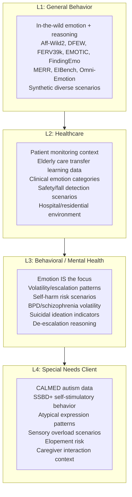

# Multimodal Emotion Reasoning Pipeline: Revised Research & Implementation Plan

---

## 1. Competitive Differentiation: Where Omni-Emotion and Peers Fall Short

### 1A. Omni-Emotion Architecture (Detailed Gap Analysis)

Omni-Emotion (Alibaba, Jan 2025) is the closest comparable project. It is built on **LLaVA-OneVision-7B** (not a thinking/reasoning model), extends it with:

- **Whisper-large-v3** audio encoder (ASR + mel-spectrogram, pooled to 60ms tokens)
- **FaceXFormer** facial encoder (multi-scale features + MLP fusion)
- Three visual fusion strategies tested: frame-level concat, cross-attention (face as query, visual as key/value), video-level concat

**Specific gaps your pipeline will exploit:**


| Gap                      | Omni-Emotion                                                                                                                            | Your Pipeline                                                                                                                                                                         |
| ------------------------ | --------------------------------------------------------------------------------------------------------------------------------------- | ------------------------------------------------------------------------------------------------------------------------------------------------------------------------------------- |
| **Reasoning**            | No thinking/CoT. Prompt -> response pairs only. GPT-3.5 for consistency.                                                                | Qwen3-VL-8B-**Thinking** with explicit `<think>` blocks. GPT-4/Claude as teacher.                                                                                                     |
| **Base model**           | LLaVA-OneVision-7B (older arch)                                                                                                         | Qwen3-VL-8B-Thinking (Interleaved-MRoPE, DeepStack, 2025 SoTA)                                                                                                                        |
| **Data sources**         | 100% cinematic media (DFEW, MAFW, FERV39k, CAER, AFEW-VA, RAVDESS, MER24). Removed RAVDESS studio footage but rest is all movies/acted. | 4-tier hierarchy: cinematic + in-the-wild + domain-proximate + synthetic volatile. Content-agnostic by design.                                                                        |
| **Temporal modeling**    | None. Single-clip analysis. No time series, no volatility, no stationarity, no lag analysis.                                            | Full data science pipeline: VAR, ARIMA/SARIMA, Granger causality, Random Forest feature importance, rolling statistics, change-point detection                                        |
| **Audio depth**          | Whisper only (ASR + basic audio). No acoustic features, no non-verbal cues, no emotion2vec.                                             | Wav2Vec2 + CLAP + emotion2vec + librosa (F0, energy, MFCCs, spectral centroid, tempo, ZCR) + non-verbal cue classification (sigh, groan, agitation, whimper) via trainer_corpus_suite |
| **Event detection**      | None. Classification only.                                                                                                              | Personalized baseline calibration, z-score deviation, CUSUM change-point, composite scoring rubric with clinical tiers, A/B tested thresholds                                         |
| **Body language**        | Face only (FaceXFormer). No body pose, no motion analysis.                                                                              | YOLO26x-pose (17 keypoints) + optical flow + erratic motion detection + DEEMO non-facial body language data                                                                           |
| **Safety/content**       | None                                                                                                                                    | NudeNet + configurable labels + data sanitization (already in trainer_corpus_suite)                                                                                                   |
| **Personalization**      | None. One-size-fits-all model.                                                                                                          | Per-individual baseline calibration, few-shot facility adaptation, adaptive thresholds with human-in-the-loop feedback                                                                |
| **Dataset size**         | 24,137 coarse + 3,500 fine = 27,637 total                                                                                               | Target 6,000-10,000 high-quality reasoning samples (quality over quantity), but with 4-tier diversity that no single dataset achieves                                                 |
| **Domain applicability** | General emotion recognition                                                                                                             | Customizable: General -> Healthcare -> Behavioral/MH -> Client-specific                                                                                                               |
| **Omnimodal future**     | Tied to LLaVA architecture                                                                                                              | Dataset formatted for interleaved modality training (Ola/OpenOmni-compatible)                                                                                                         |


### 1B. Gaps in Other Projects

- **Emotion-LLaMA/MERR**: No quality assurance on reasoning annotations, no facial encoder, older LLaMA base
- **EIBench**: Small (1,665 samples), image-only, no audio, no temporal
- **MTMEUR**: Multi-turn but no thinking mode, no deployment pipeline, academic benchmark only
- **MindGuard**: Edge LLM for mental health but no emotion CV, no multimodal fusion
- **Healthcare transformer framework** (ACL 2025): Whisper + DeepFace + BERT but no VLM reasoning, no temporal dynamics, only 3 clinical categories

---

## 2. Your Existing Pipeline: trainer_corpus_suite as Foundation

Your [trainer_corpus_suite](trainer_corpus_suite/) already implements much of what Omni-Emotion lacks. Key existing capabilities that become competitive advantages:

**Already Built (ready to leverage):**

- Emotion detection: DeepFace 7 emotions + valence/arousal + pain-pleasure + entropy + temporal arcs (escalating/de-escalating/building/releasing/stable/volatile)
- Audio: Wav2Vec2 + CLAP + emotion2vec + pyannote VAD + full librosa feature extraction + non-verbal cue classification
- Demographics: MiVOLO v2 + FairFace cross-validation + disagreement flagging
- Pose: YOLO26x-pose 17-keypoint tracking
- Motion: Farneback optical flow + erratic motion detection + motion ratios
- Safety: NudeNet with configurable labels
- VLM captioning: Qwen2.5-VL-7B with context prepending from all detectors
- Scene splitting: PySceneDetect content-based
- Data assembly: unified CSV + training manifest JSON
- Priority scoring: composite quality metric (emotion intensity 25%, person coverage 15%, motion interest 10%, etc.)
- Dual output tracks: Professional (CoT reasoning) and Hobby (diffusion conditioning)
- Data sanitization for AI-safe review

**Needs to be Added:**

- Data science statistical models: Random Forest, VAR, ARIMA/SARIMA
- A/B testing framework for threshold validation
- Distribution analysis and threshold formation module
- `<think>` reasoning format generation for Qwen3-VL-8B-Thinking training data
- Hierarchical dataset layering (L1-L4)
- Omnimodal interleaved format output

---

## 3. Four-Layer Hierarchical Dataset Architecture

The dataset is structured as nested layers where each level inherits and extends the parent:




**Layer Design Principles:**

- Each layer adds domain-specific reasoning examples to the parent dataset
- A model trained on L1+L2 serves general healthcare; L1+L2+L3 serves behavioral/MH; all four layers serve the client
- Layers are modular -- new clients/verticals add a new L4 without retraining L1-L3
- This is the **marketable/customizable** dimension: sell L1+L2 as a product, add L3/L4 as vertical specializations

**Per-Layer Dataset Composition:**

- **L1** (~4,000-5,000 samples): General reasoning + in-the-wild robustness. Sources: MERR (adapted), EIBench (adapted), Aff-Wild2/DFEW/EMOTIC/FindingEmo (re-captioned with reasoning), Omni-Emotion SRE subset, synthetic content-agnostic scenarios
- **L2** (~1,500-2,000 samples): Healthcare context overlay. Sources: Elderly care transfer learning data, clinical emotion frameworks (Distress/Stable/Engaged), patient monitoring scenarios (synthetic), safety/fall scenarios
- **L3** (~1,000-1,500 samples): Behavioral/MH focus. Sources: EVI volatility patterns, escalation/de-escalation sequences, self-harm risk scenarios (synthetic with clinical grounding), BPD/schizophrenia volatility patterns from mobile phenotyping literature
- **L4** (~500-1,000 samples): Client-specific. Sources: CALMED, SSBD+, DEEMO body language, atypical expression scenarios, sensory overload, elopement risk, caregiver interaction (mostly synthetic with clinical framework grounding, augmented by real data as collected)

---

## 4. Data Science Module (New Addition to Pipeline)

These modules fill the gap between raw emotion scores and actionable event detection. They are what no existing project implements.

### 4A. Statistical Time Series Analysis

Add to trainer_corpus_suite or as a standalone module:

- **Stationarity testing**: ADF/KPSS per emotion channel. Auto-difference if nonstationary.
- **Collinearity reduction**: VIF across 8 emotions. PCA/ICA to 3 orthogonal components (valence/arousal/dominance proxy). Known pairs: anger-disgust (r~0.6), fear-surprise (onset), sadness-contempt.
- **Lag analysis**: ACF/PACF per channel + cross-correlation matrix. AIC/BIC for optimal lag selection.
- **Granger Causality**: Sparse/regularized GC to test directed temporal dependencies (does anger at t-1 predict fear at t?). Multi-frequency band analysis.
- **VAR model**: Multivariate autoregressive across all channels with optimal lag. Forecast emotion trajectories.
- **ARIMA/SARIMA**: Per-channel univariate forecasting with seasonal component (accounts for daily rhythms in monitored individuals).

### 4B. Machine Learning Feature Importance

- **Random Forest**: Train on emotion feature vectors (8 emotions + valence + arousal + volatility + motion + audio features) with a binary target (event/non-event from initial conservative thresholds). Use SHAP/feature importance to identify which features are most predictive of escalation.
- **Gradient Boosted Trees / XGBoost**: Alternative ensemble for comparison. Explainable Boosting Machines (EBMs) for glass-box interpretability.
- **Anomaly detection models**: Isolation Forest, One-Class SVM on personalized baselines.

### 4C. A/B Testing & Threshold Formation

This is the novel methodological contribution:

1. **Initial threshold derivation**: Use distribution analysis (per-individual and population-level) to set initial z-score thresholds for each emotion channel + composite score.
2. **A/B testing framework**: Deploy two threshold configurations simultaneously to different monitoring sessions. Compare false positive rates, caregiver feedback, and event capture rates. Use multi-criteria A/B design (beyond ATE) to simultaneously optimize sensitivity, specificity, and caregiver burden.
3. **Threshold refinement cycle**: Statistical testing (Edgeworth correction for non-Gaussian emotion distributions) determines when one configuration is significantly better. Update thresholds. Repeat.
4. **Population vs. individual thresholds**: A/B test whether personalized thresholds (per-individual baseline) outperform population-level thresholds. Literature suggests they do (LSTM autoencoder study: F1=0.80 with personalized baselines).

### 4D. Event Criteria Formation

The "loose definition of an event" is formalized through data-driven criteria:

- **Composite Event Score** = weighted sum of:
  - Emotion deviation from baseline (z-score, per-channel)
  - Volatility index (rolling-window std)
  - Transition rate (emotion change velocity)
  - Audio arousal indicators (volume spike, non-verbal cue detection)
  - Motion indicators (erratic motion ratio from optical flow)
  - RF/XGBoost predicted probability of escalation
- **Event tiers** (configurable per deployment):
  - Tier 1 (Immediate -> VLM): Composite score > threshold_1 OR single-channel > 3sigma OR audio alarm cue
  - Tier 2 (Urgent -> VLM queue): Sustained deviation > 2sigma for > T seconds OR volatility spike
  - Tier 3 (Log + monitor): Mild deviation, gradual drift, single-frame anomaly
- **Hysteresis and cooldown**: Prevent re-triggering within configurable window. Edge device maintains state.

---

## 5. QLoRA Training Strategy (Revised)

### 5A. First Pass: Text-Only QLoRA

**Why text-first**: The edge device already runs emotion CV. The VLM receives flagged events with emotion scores + audio features + context. Text-only QLoRA teaches the VLM to *reason about* these structured inputs, not to re-detect emotions from pixels.

**Training data format** (ChatML with `<think>` blocks):

```
<|im_start|>system
You are an emotion analysis expert monitoring individuals in a care environment. You receive emotion recognition scores, audio analysis, and contextual data from edge devices. Reason through the data to assess the situation and provide an actionable interpretation.<|im_end|>
<|im_start|>user
EVENT REPORT:
- Subject: Individual #12, baseline profile: typically neutral (0.72) with mild anxiety (fear 0.15)
- Current window (last 45s): anger 0.78 -> 0.85 -> 0.91, fear 0.12 -> 0.35 -> 0.52
- Baseline deviation: anger +3.2 sigma, fear +2.8 sigma
- Volatility index: 0.82 (high, baseline 0.15)
- Audio: volume spike detected at t+30s, non-verbal cue: agitation/whimper
- Motion: erratic motion ratio 0.67 (baseline 0.08)
- Environment: residential care facility, afternoon
- Prior 24h: 2 mild episodes (Tier 3), no Tier 1/2 events

Assess the situation and recommend action.<|im_end|>
<|im_start|>assistant
<think>
Let me analyze the multi-channel data systematically.

Emotion trajectory: Anger is escalating rapidly (0.78 -> 0.91 in 45s) and now 3.2 sigma above this individual's baseline. Fear is co-escalating (2.8 sigma), which is concerning because anger-fear co-occurrence in this individual's history is unusual -- their baseline shows anxiety (fear 0.15) but not anger.

The anger-fear co-escalation pattern, combined with the volatility index spike (0.82 vs baseline 0.15), suggests this is not normal fluctuation but a behavioral escalation in progress.

Audio confirms: volume spike at t+30s aligns with the emotion trajectory peak, and the agitation/whimper classification suggests distress rather than directed anger.

Motion data supports: erratic motion ratio jumped from 0.08 to 0.67, consistent with physical agitation or self-stimulatory behavior escalation.

The two prior Tier 3 episodes in the last 24 hours may indicate a building pattern -- this could be cumulative.

Risk assessment: High. Multiple channels converging. This is a Tier 1 event.
</think>

**ASSESSMENT: Tier 1 - Immediate Attention Required**

**Situation**: Individual #12 is experiencing a rapid behavioral escalation. Anger and fear are co-escalating significantly above their personal baseline, accompanied by physical agitation and vocal distress.

**Key indicators**:
- Anger at 3.2x standard deviation above baseline and still rising
- Fear co-escalation is atypical for this individual
- Physical agitation confirmed by motion sensors
- Vocal distress (agitation/whimper) detected

**Context**: Two prior mild episodes in 24 hours suggest possible cumulative stress. Current episode is qualitatively different (anger-fear co-occurrence vs typical anxiety-only pattern).

**Recommended action**: Caregiver should approach calmly and assess for environmental triggers. Check for sensory overload. This individual's care plan should be reviewed for pattern of escalating days.<|im_end|>
```

### 5B. Dataset Composition (Revised for 4-Layer Hierarchy)

**Total: 7,000-10,000 samples across all layers**

**75% reasoning (with `<think>` blocks):**

- L1 General (~2,500): Adapted from MERR/EIBench/Omni-Emotion + in-the-wild re-captioned + synthetic diverse
- L2 Healthcare (~1,200): Patient monitoring, safety, clinical categories
- L3 Behavioral/MH (~1,000): Volatility, escalation, de-escalation, self-harm risk, BPD/schizophrenia patterns
- L4 Special Needs (~600): Autism/atypical expressions, sensory overload, elopement, caregiver interaction

**25% non-reasoning (direct responses, no `<think>`):**

- False positive training (~500): Scenarios the model should NOT escalate (excited play, normal stimming, routine transitions)
- Simple classification (~400): Direct emotion identification without extensive reasoning
- Factual responses (~300): Information requests about the monitoring system

### 5C. Second Pass: Vision QLoRA (After First Pass Validated)

After text-only QLoRA proves the reasoning capability, extend to include video frames:

- Use Qwen3-VL-8B-Thinking's native vision pipeline
- Training samples include image/video tokens + emotion scores + audio features
- Target ~10,000-15,000 vision+text samples
- Leverage trainer_corpus_suite's low-FPS VLM copies as image input

### 5D. Preserving Thinking Mode

- 75/25 reasoning mix (already covered above)
- Two-phase recipe: train reasoning first, then hybrid think/no-think
- Use `<think>` / `</think>` control tokens from different questions (not paired same-question answers)
- Unsloth QLoRA with targets: q_proj, k_proj, v_proj, o_proj, gate_proj, up_proj, down_proj

---

## 6. Cross-Attention ViT/DiT Architecture (Final Step)

This is the research frontier -- after QLoRA validates the approach, explore custom fusion architectures:

### 6A. Current SoTA Approaches (2025)

- **ECMF**: Dual-branch visual encoders (global frame + localized facial) + self-attention dynamic modality weighting
- **MemoCMT**: Cross-modal transformer with HuBERT audio + BERT text, min aggregation fusion (81-92% on IEMOCAP/ESD)
- **AVT-CA**: Hierarchical video features + channel/spatial attention + cross-attention audio-visual fusion
- **Sync-TVA**: Graph-attention with dynamic modality-specific enhancement + structured heterogeneous cross-modal graphs

### 6B. Proposed Innovation Direction

What none of these projects do (and what your pipeline enables):

1. **Temporal cross-attention with data-science features**: Instead of raw frame-to-frame cross-attention, inject VAR/ARIMA forecast vectors and Granger causality indicators as additional attention keys. The model attends to both raw visual features AND statistical trajectory predictions.
2. **Hierarchical encoder with body+face+scene**: Use YOLO-pose (body) + FaceXFormer/DeepFace (face) + general ViT (scene) as three encoder branches. Cross-attention fuses them with learned modality importance weights that vary per emotion channel.
3. **Audio-visual synchrony attention**: Use CLAP embeddings as a bridge between audio and visual branches. Non-verbal cue classifications become explicit attention keys (the model knows "agitation detected in audio" and attends to corresponding visual frames).
4. **DiT-style conditioning**: Borrow from diffusion transformer conditioning -- inject emotion volatility, baseline deviation, and temporal arc indicators as conditioning signals into the transformer, similar to how DiT conditions on timestep/class. This gives the architecture explicit access to the data-science-derived features.

---

## 7. Omnimodal Future-Proofing

To ensure the dataset can train future omnimodal models (Ola, OpenOmni, Qwen3-Omni style):

### 7A. Dataset Format Requirements

- **Interleaved modality tokens**: Store each sample with explicit modality markers:
  - `<<<vi_start>>>` ... `<<<vi_end>>>` for visual
  - `<<<au_start>>>` ... `<<<au_end>>>` for audio
  - `<<<ts_start>>>` ... `<<<ts_end>>>` for time-series/statistical features (novel)
  - `<<<pose_start>>>` ... `<<<pose_end>>>` for body pose keypoints
- **Progressive alignment compatible**: Ola uses video as central bridge modality. Store video as the primary modality with audio and text aligned to video timestamps.
- **Raw assets preserved**: Store original video clips, audio segments, and extracted frames alongside structured annotations. Don't discard raw modalities.

### 7B. Metadata Schema

Each sample should carry:

- Layer tag (L1/L2/L3/L4)
- Modalities present (video/audio/text/pose/emotion_scores/statistical_features)
- Reasoning type (thinking/non-thinking)
- Source dataset + license
- Quality score (from trainer_corpus_suite priority scoring)
- Domain tags (general/healthcare/behavioral/special_needs)
- Individual baseline reference (if personalized)

---

## 8. End-to-End Pipeline Architecture (Revised)

```mermaid
flowchart TD
    subgraph dataPrep [Dataset Preparation Pipeline]
        TCS[trainer_corpus_suite]
        DataSci[Data Science Module\nRF / VAR / ARIMA\nDistribution Analysis]
        TeacherLLM[Teacher LLM\nGPT-4 / Claude\nReasoning Generation]
        HierDS[4-Layer Hierarchical\nDataset Assembly]
    end

    subgraph training [Model Training]
        QLoRA1[QLoRA Pass 1\nText-Only Reasoning]
        QLoRA2[QLoRA Pass 2\nVision + Text]
        CrossAttn[Cross-Attention\nViT/DiT Research]
        OmniModal[Future Omnimodal\nFull Finetune]
    end

    subgraph deployment [Deployment Pipeline]
        Edge[Edge Device\nEmotion CV + Audio\n+ Pose + Motion]
        ThreshEng[Threshold Engine\nBaseline + CUSUM\n+ RF Scoring]
        CloudVLM[Cloud GPU\nQwen3-VL-8B-Thinking\n+ QLoRA Adapter]
        Client[Client Dashboard\n+ Caregiver Alerts]
    end

    TCS --> DataSci
    DataSci --> HierDS
    TeacherLLM --> HierDS
    HierDS --> QLoRA1
    QLoRA1 --> QLoRA2
    QLoRA2 --> CrossAttn
    CrossAttn --> OmniModal

    Edge --> ThreshEng
    ThreshEng -->|"Flagged events"| CloudVLM
    CloudVLM -->|"Reasoning output"| Client
    ThreshEng -->|"Tier 3: log"| Client
end
```


---

## 9. Implementation Phases (Revised)

### Phase 1: Data Science Module + Threshold Engine

- Add RF, VAR, ARIMA/SARIMA, distribution analysis modules (new code or augment trainer_corpus_suite)
- Implement personalized baseline calibration
- Build composite event scoring with configurable tiers
- Design A/B testing framework for threshold validation

### Phase 2: Hierarchical Dataset Assembly

- Curate L1 from existing public datasets (MERR, EIBench, Aff-Wild2, DFEW, EMOTIC, FindingEmo, Omni-Emotion SRE)
- Generate L2-L4 synthetic reasoning data via teacher LLM
- Process all through trainer_corpus_suite for multi-detector enrichment
- Format with interleaved modality tokens and layer tags for omnimodal future-proofing

### Phase 3: First Pass QLoRA (Text-Only)

- Train text-only reasoning adapter on Qwen3-VL-8B-Thinking
- 75/25 reasoning mix, ChatML + `<think>` blocks
- Validate against EIBench, EMER, EMER-OV benchmarks (target: exceed Omni-Emotion's clue overlap 8.22 and EMER-OV 65.9)
- Deploy on existing vLLM server for integration testing

### Phase 4: Second Pass QLoRA (Vision + Text)

- Extend dataset with video frames from trainer_corpus_suite low-FPS copies
- Train vision-inclusive adapter
- A/B test against text-only adapter for interpretation quality

### Phase 5: Audio Integration + Omnimodal Prep

- Integrate audio features into the training data (descriptions first, raw audio embeddings for omnimodal)
- Validate multi-modal reasoning improvement

### Phase 6: Cross-Attention ViT/DiT Research (Final)

- Prototype custom dual/triple-branch encoder with learned modality attention
- DiT-style conditioning with data-science features
- Full model finetune if results warrant

### Phase 7: Productization

- Package L1+L2 as general healthcare product
- L3 as behavioral/MH vertical addon
- L4 as client-specific customization layer
- A/B testing framework as configurable deployment tool

---

## 10. Benchmark Targets (Exceed Omni-Emotion)

- **EMER clue overlap**: Omni-Emotion = 8.22. Target: > 9.0 (with thinking-mode reasoning providing richer clues)
- **EMER-OV average score**: Omni-Emotion = 65.9. Target: > 70.0
- **DFEW UAR**: Omni-Emotion = 68.80. Target: maintain or exceed (may not improve with text-only QLoRA; vision QLoRA needed)
- **MAFW UAR**: Omni-Emotion = 53.81. Target: > 56.0
- **Novel metrics** (your pipeline introduces these):
  - Event detection precision/recall (no existing benchmark)
  - Reasoning quality score (human evaluation of `<think>` traces)
  - Cross-population generalization (neurotypical -> atypical expression accuracy)
  - Threshold adaptation speed (time to converge per-individual)

---

## 11. Key References

### Reasoning / Instruction-Tuning Datasets

- Emotion-LLaMA / MERR: [github.com/ZebangCheng/Emotion-LLaMA](https://github.com/ZebangCheng/Emotion-LLaMA)
- Omni-Emotion: [github.com/HumanMLLM/Omni-Emotion](https://github.com/HumanMLLM/Omni-Emotion)
- EIBench: [github.com/Lum1104/EIBench](https://github.com/Lum1104/EIBench)

### In-the-Wild / Robustness Datasets

- Aff-Wild2: [ibug.doc.ic.ac.uk/resources/aff-wild2](https://ibug.doc.ic.ac.uk/resources/aff-wild2)
- DFEW: [dfew-dataset.github.io](https://dfew-dataset.github.io/)
- FERV39k: [github.com/wangyanckxx/FERV39k](https://github.com/wangyanckxx/FERV39k)
- EMOTIC: [s3.sunai.uoc.edu/emotic](https://s3.sunai.uoc.edu/emotic/index.html)
- FindingEmo: [arxiv.org/abs/2402.01355](https://arxiv.org/abs/2402.01355)

### Domain-Proximate (Special Needs / Atypical)

- CALMED (autism): [arxiv.org/abs/2307.13706](https://arxiv.org/abs/2307.13706)
- SSBD+ (self-stimulatory): [arxiv.org/abs/2311.15072](https://arxiv.org/abs/2311.15072)
- DEEMO (de-identified body language): [arxiv.org/abs/2504.19549](https://arxiv.org/abs/2504.19549)
- egoEMOTION (egocentric): [arxiv.org/html/2510.22129v2](https://arxiv.org/html/2510.22129v2)

### Cross-Attention / Fusion Architectures

- ECMF dual-branch: [arxiv.org/abs/2508.05991](https://arxiv.org/abs/2508.05991)
- MemoCMT cross-modal transformer: [doi.org/10.1038/s41598-025-89202-x](https://www.nature.com/articles/s41598-025-89202-x)
- AVT-CA audio-video cross-attention: [arxiv.org/abs/2407.18552](https://arxiv.org/abs/2407.18552)
- Sync-TVA graph-attention: [arxiv.org/abs/2507.21395](https://arxiv.org/abs/2507.21395)

### Omnimodal Training

- Ola omnimodal: [arxiv.org/abs/2502.04328](https://arxiv.org/abs/2502.04328)
- OpenOmni: [arxiv.org/abs/2501.04561](https://arxiv.org/abs/2501.04561)
- Qwen3-Omni: [arxiv.org/html/2509.17765v1](https://arxiv.org/html/2509.17765v1)

### Training / QLoRA

- Unsloth Qwen3-VL: [docs.unsloth.ai/docs/models/qwen3-vl-how-to-run-and-fine-tune](https://docs.unsloth.ai/docs/models/qwen3-vl-how-to-run-and-fine-tune)
- Qwen3 Technical Report (hybrid thinking): [arxiv.org/html/2505.09388v1](https://arxiv.org/html/2505.09388v1)
- Demystifying Hybrid Thinking: [arxiv.org/html/2510.12680v1](https://arxiv.org/html/2510.12680v1)
- Contrastive Distillation for Emotion: [arxiv.org/abs/2505.18040](https://arxiv.org/abs/2505.18040)

### Threshold / Event Detection

- DRE-CUSUM: [arxiv.org/abs/2201.11678](https://arxiv.org/abs/2201.11678)
- FOCuS: [jmlr.org/papers/v24/21-1230](https://jmlr.org/papers/v24/21-1230.html)
- Emotional Volatility Index: [papers.ssrn.com/abstract=5210230](https://papers.ssrn.com/sol3/papers.cfm?abstract_id=5210230)
- Adaptive Anomaly Scoring: [arxiv.org/abs/2505.02299](https://arxiv.org/abs/2505.02299)

### Clinical / Domain Adaptation

- Healthcare emotion framework (ACL 2025): [aclanthology.org/2025.nlpai4health-main.1](https://aclanthology.org/2025.nlpai4health-main.1/)
- Elderly care transfer learning: [doi.org/10.1007/s44163-025-00280-2](https://link.springer.com/content/pdf/10.1007/s44163-025-00280-2.pdf)
- Mobile phenotyping for SMI: [doi.org/10.1038/s41398-025-03394-4](https://www.nature.com/articles/s41398-025-03394-4)
- Atypical expression bias: [doi.org/10.1007/s10803-025-07120-3](https://link.springer.com/article/10.1007/s10803-025-07120-3)
- VLM Social-Pragmatic Inference Gap: [aclanthology.org/2025.findings-emnlp.1252](https://aclanthology.org/2025.findings-emnlp.1252/)

