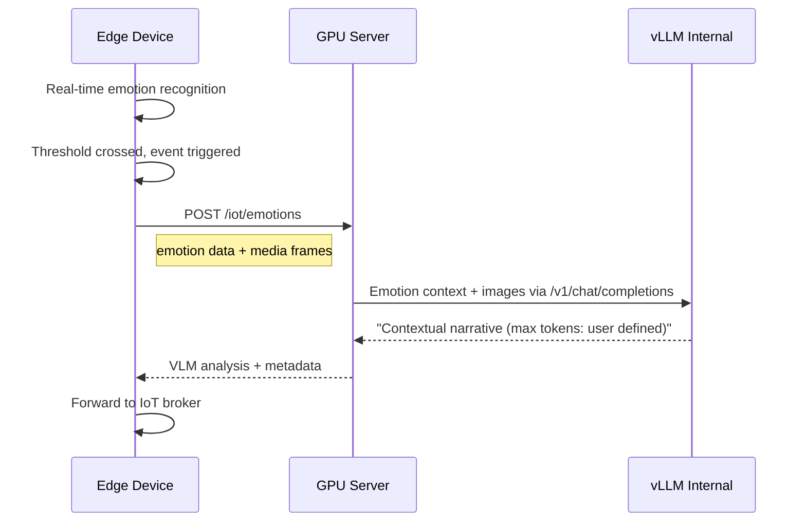

# Redesign `/iot/emotions` -- VLM Contextual Analysis

## Corrected Architecture

The edge device does emotion recognition locally in real time. The GPU server's role is to take that output plus the media, feed it to the VLM, and return a **contextual narrative** explaining what triggered the event.



---

## New Payload: Edge -> GPU

`POST /iot/emotions`

```json
{
  "event_id": "EV2-1707782400000-jetson007",
  "employee_id": "arjun_joshi_0042",
  "emotion_recognition": {
    "trigger": {
      "frame": 47,
      "timestamp_ms": 3133,
      "happiness": 0.12,
      "sadness": 0.85,
      "anger": 0.45,
      "fear": 0.30,
      "surprise": 0.05,
      "disgust": 0.02,
      "contempt": 0.01,
      "valence": -0.72
    },
    "timeline": [
      {
        "frame": 0,
        "timestamp_ms": 0,
        "happiness": 0.65,
        "sadness": 0.05,
        "anger": 0.02,
        "fear": 0.01,
        "surprise": 0.03,
        "disgust": 0.01,
        "contempt": 0.00,
        "valence": 0.60
      }
    ]
  },
  "media": {
    "type": "images",
    "frames": [
      { "frame": 0, "data": "<base64>" },
      { "frame": 47, "data": "<base64>" }
    ]
  }
}
```

- `emotion_recognition.trigger` -- the reading at the moment the threshold was crossed
- `emotion_recognition.timeline` -- array of readings over time (per-frame or per-second)
- `media.type` -- `"images"` now; will become `"video"` when the pipeline evolves to accept .mp4
- `media.frames` -- base64 image frames (current); future: replaced or supplemented by a video field

---

## New Payload: GPU -> Edge

```json
{
  "event_id": "EV2-1707782400000-jetson007",
  "gpu_processing_event_id": "gpu-vlm-a3f8c201",
  "employee_id": "arjun_joshi_0042",
  "timestamp": "2026-02-12T18:45:03Z",
  "vlm_analysis": {
    "narrative": "The subject transitions from a calm state to visible distress around frame 47. Sadness and anger spike simultaneously, suggesting a reactive response. The video shows a tense interaction near a workstation -- body language shifts from open to closed posture. Pattern consistent with workplace conflict rather than personal distress.",
    "token_count": 62,
    "model": "Qwen/Qwen3-VL-8B-Thinking"
  },
  "processing_time_ms": 4200
}
```

- `gpu_processing_event_id` -- unique ID generated by the GPU server for this processing run
- `vlm_analysis.narrative` -- free-text contextual analysis (length governed by system prompt / vLLM config)
- `vlm_analysis.token_count` -- actual tokens used
- `vlm_analysis.model` -- which VLM produced it

---

## Changes Required

### 1. New Pydantic models in `app/main.py`

Replace `VLMImageInput`, `VLMRequest`, `VLMResponse` with:

- **`EmotionFrame`** -- single reading: 7 floats (happiness, sadness, anger, fear, surprise, disgust, contempt) + valence + frame index + timestamp_ms
- **`EmotionRecognitionData`** -- `trigger: EmotionFrame` + `timeline: List[EmotionFrame]`
- **`MediaFrame`** -- `frame: int` + `data: str` (base64)
- **`MediaInput`** -- `type: str` (default `"images"`) + `frames: List[MediaFrame]`
- **`EmotionsRequest`** -- `event_id`, `employee_id`, `emotion_recognition: EmotionRecognitionData`, `media: MediaInput`, optional `options`
- **`VLMAnalysis`** -- `narrative: str`, `token_count: int`, `model: str`
- **`EmotionsResponse`** -- `event_id`, `gpu_processing_event_id`, `employee_id`, `timestamp`, `vlm_analysis: VLMAnalysis`, `processing_time_ms`

### 2. Rewrite emotion processor in `app/processors/emotion.py`

The `process()` method signature changes:

- **Old:** receives `images` (raw bytes), does emotion detection itself
- **New:** receives `emotion_recognition` data + `media` frames, constructs a VLM prompt that includes the emotion context, sends media + prompt to vLLM, returns the narrative

The VLM prompt changes from "analyze the emotion in this image" to something like:

> You are analyzing a workplace emotion recognition event. The edge device detected the following emotion scores at the trigger moment: [trigger data]. Here is the emotion timeline leading up to the event: [timeline data]. Examine the provided images and describe: (1) what is happening in the scene, (2) what likely caused the emotional shift, (3) any contextual observations. Be concise.

### 3. Update endpoint handler in `app/main.py`

The `vlm_analyze()` handler passes `emotion_recognition` and `media` to the processor, generates a `gpu_processing_event_id`, and builds the new `EmotionsResponse`.

### 4. `api_routes.yaml`

No path changes needed -- endpoint stays `/iot/emotions`. Only the payload shape changes.

---

## Files touched

- **`app/main.py`** -- new Pydantic models, updated endpoint handler
- **`app/processors/emotion.py`** -- rewrite `process()` and `_process_vllm()` for contextual analysis
- No changes to `api_routes.yaml`, `config.yaml`, Dockerfile, or embedding processor
